```mermaid
flowchart LR
  %% =========================
  %% TARGET ARCHITECTURE
  %% LangChain4j 1.10.0 + MCP + Claude + GitHub MCP Server
  %% =========================

  subgraph STUDENT["✅ Developed by the student (this lab)"]
    direction TB

    SB["Spring Boot App<br/>lab_mcp_ai_agent_springboot"]
    API["REST API<br/>POST /api/agent/run"]
    LC["LangChain4j Agent<br/>BacklogAgent + AiServices"]
    TOOLS["LangChain4j @Tool Bridge<br/>GitHubMcpTools"]
    MCPCLIENT["MCP HTTP Client<br/>JSON-RPC over HTTP<br/>(tools/list, tools/call)"]

    API --> SB
    SB --> LC
    LC --> TOOLS
    TOOLS --> MCPCLIENT
  end

  subgraph GITHUB["🧩 Provided by GitHub (not developed by students)"]
    direction TB

    MCPSERVER["GitHub MCP Server<br/>(official)"]
    GHAPI["GitHub REST API<br/>Issues endpoints"]
    GHREPO["GitHub Repository<br/>Issues / PRs / Actions"]
    MCPSERVER --> GHAPI
    GHAPI --> GHREPO
  end

  subgraph ANTHROPIC["☁️ External service"]
    direction TB
    CLAUDE["Claude (Anthropic)<br/>Chat Model API"]
  end

  %% External calls
  LC <-- "LLM requests / tool calls" --> CLAUDE
  MCPCLIENT -->|"HTTP JSON-RPC<br/>/mcp"| MCPSERVER

  %% Notes (optional)
  classDef student fill:#eaffea,stroke:#2f7d32,stroke-width:2px,color:#0b3d0b;
  classDef github fill:#eaf2ff,stroke:#1d4ed8,stroke-width:2px,color:#0b1d4d;
  classDef external fill:#fff3e6,stroke:#b45309,stroke-width:2px,color:#4a2a00;

  class SB,API,LC,TOOLS,MCPCLIENT student;
  class MCPSERVER,GHAPI,GHREPO github;
  class CLAUDE external;
```

# 🧪 LAB – Building an MCP AI Agent with Claude
**Java · Spring Boot · Gradle · LangChain4j · MCP · Claude · Testing · CI/CD · Docker · GitHub**

---

## 🎯 Global Lab Objective

Build **step by step** an **AI agent** able to:

1. understand a natural language request,
2. reason with **Claude (Anthropic)**,
3. calls **standardized tools via MCP**,
4. automatically create a **GitHub issue**,
5. be **tested**, **containerized**, and **integrated into CI/CD**.

---

## 🧠 End-to-end Use Case

> “Create a task to add OpenTelemetry and export traces via OTLP”

⟶ a **well-structured GitHub issue** is created automatically.

---

## 🏗️ Target Architecture

```text
User
  ↓
LangChain4j Agent (Claude)
  ↓ tool call (@Tool)
MCP Client (Spring Boot)
  ↓ JSON‑RPC (HTTP)
MCP Server (GitHub tools)
  ↓
GitHub API (Issues)
```



---

# 🧭 Mandatory Rule – Issue‑Driven Development (GitHub)

> ⚠️ **This lab MUST be executed in an issue‑driven manner.**  
> **No code is allowed without a GitHub ticket.**

All steps in this lab must follow **professional agile practices**, exactly as in a real engineering team.

---

## 🧠 Core Principle

- **1 STEP = 1 GitHub Issue**
- **All steps belong to a single Feature / Epic**
- Each issue must be:
  - created before coding
  - implemented on a dedicated branch
  - linked to commits
  - closed via a Pull Request

---

## 🧩 GitHub Structure to Use

### 1️⃣ Feature / Epic (created once)

Create a GitHub Issue:

**Title**
```
[FEATURE] AI Agent – LangChain4j + MCP + Claude
```

**Description**
```md
-## Goal
Build an AI agent using LangChain4j 1.10.0 that:
- reasons with Claude (Anthropic)
- calls tools via MCP
- creates GitHub issues automatically

-## Scope
- Spring Boot
- LangChain4j 1.10.0
- MCP (HTTP / JSON‑RPC)
- Docker
- CI/CD

-## Tasks
All implementation steps are tracked as child issues.
```

👉 This issue stays **OPEN until the end of the lab**.

---

### 2️⃣ One GitHub Issue per STEP

Each step in this lab **must have its own issue**.

**Naming convention**
```
[STEP X] <short description>
```

---

## 🔗 STEP ↔ GitHub Issue Mapping

| Lab Step | GitHub Issue Title |
|--------|-------------------|
| STEP 1 | `[STEP 1] Bootstrap project with Spring Initializr` |
| STEP 2 | `[STEP 2] Add LangChain4j 1.10.0 dependencies` |
| STEP 3 | `[STEP 3] Configure Anthropic and MCP endpoints` |
| STEP 4 | `[STEP 4] Connect LangChain4j to Claude` |
| STEP 5 | `[STEP 5] Implement MCP HTTP client` |
| STEP 6 | `[STEP 6] Bridge MCP tools with LangChain4j` |
| STEP 7 | `[STEP 7] Expose Agent REST API` |
| STEP 8 | `[STEP 8] Add unit tests for MCP bridge` |
| STEP 9 | `[STEP 9] Add integration tests` |
| STEP 10 | `[STEP 10] Dockerize the agent` |
| STEP 11 | `[STEP 11] Setup CI/CD with GitHub Actions` |

---

## 📄 Standard Issue Template (MANDATORY)

Each STEP issue **must follow this template**:

```md
-## Context
Why this step is required.

-## Goal
What must be implemented.

-## Acceptance Criteria
- [ ] Code implemented
- [ ] Tests added (if applicable)
- [ ] Build passes
- [ ] CI is green

-## Out of Scope
Explicitly excluded items.

-## References
- Lab STEP X
```

---

## 🌱 Branch & Commit Rules

For each issue:

```bash
git checkout -b step-X-short-description
```

Commits **must reference the issue number**:

```bash
git commit -m "feat(step-X): <short description> (#ISSUE_ID)"
```

---

## 🔁 Pull Request Rules

- One PR per STEP
- PR description must reference the issue
- Issue is closed **only when PR is merged**

---

## 🏷️ Required GitHub Labels

Create the following labels in the repository:

- `feature`
- `bug`
- `test`
- `docker`
- `ci-cd`

---

## 🧠 Bonus (Advanced / Recommended)

From **STEP 7 onward**, students are encouraged to use the **agent itself** to manage the backlog:

> “Create a GitHub task for adding Docker support”

The agent should:
- create the GitHub issue
- which is then implemented by the students

🔥 This creates a **self‑referential agent → backlog → code loop**.

---

## ✅ Evaluation Criteria (Suggested)

- ✔️ One STEP = one closed issue
- ✔️ Commits linked to issues
- ✔️ Clean PR history
- ✔️ CI green
- ✔️ Feature / Epic closed at the end

---

# 🔹 STEP 0 — Prerequisites

- Java 21
- Git
- GitHub account + repository
- Anthropic API key
- Fine‑grained GitHub token (Issues RW)

Export secrets:

```bash
export ANTHROPIC_API_KEY=sk-ant-xxx
export GITHUB_TOKEN=github_pat_xxx
```

---

## 🔹 STEP 0.5 — Install GitHub MCP Server (Local Development)

Clone and run the official GitHub MCP Server:

https://github.com/github/github-mcp-server

```bash
git clone https://github.com/github/github-mcp-server.git
cd github-mcp-server
npm install
export GITHUB_TOKEN=github_pat_xxx
npm start
```

Validate:
```bash
curl http://localhost:3333/mcp -H "Content-Type: application/json" \
 -d '{"jsonrpc":"2.0","id":"1","method":"tools/list","params":{}}'
```

---

# 🔹 STEP 1 — Project Bootstrap with Spring Initializr

### 🎯 Objective
Generate a clean and standard **Spring Boot project skeleton** using **Spring Initializr**.

---

## 1.1 Use Spring Initializr (Web UI)

Go to 👉 https://start.spring.io

Select the following options:

- **Project**: Gradle – Groovy
- **Language**: Java
- **Spring Boot**: 3.3.x (or latest 3.x)
- **Group**: `com.example`
- **Artifact**: `mcp-agent`
- **Name**: `mcp-agent`
- **Packaging**: Jar
- **Java**: 21

### Dependencies to add:
- Spring Web
- Spring Validation

👉 Click **Generate**, unzip the project.

---

## 1.2 Alternative: Spring Initializr via CLI

If you prefer the command line:

```bash
curl https://start.spring.io/starter.zip \
  -d project=gradle \
  -d language=java \
  -d bootVersion=3.3.5 \
  -d javaVersion=21 \
  -d groupId=com.example \
  -d artifactId=mcp-agent \
  -d name=mcp-agent \
  -d dependencies=web,validation \
  -o mcp-agent.zip
```

```bash
unzip mcp-agent.zip
cd mcp-agent
```

---

## 1.3 Verify the Generated Project

Run:

```bash
./gradlew clean test
./gradlew bootRun
```

Open your browser:

👉 http://localhost:8080

You should see a **404 page** (expected, no controller yet).

✅ Spring Boot is running correctly.

---

# 🔹 STEP 2 — Dependencies : use the LangChain4j BOM (keeps versions aligned)

Edit `build.gradle`:

```gradle
dependencies {
  // Spring
  implementation "org.springframework.boot:spring-boot-starter-web"
  implementation "org.springframework:spring-webflux"

  // LangChain4j BOM (pins everything to 1.10.0)
  implementation platform("dev.langchain4j:langchain4j-bom:1.10.0")

  // LangChain4j core + Anthropic
  implementation "dev.langchain4j:langchain4j"
  implementation "dev.langchain4j:langchain4j-anthropic"

  // Optional: JDK HTTP client integration
  implementation "dev.langchain4j:langchain4j-http-client-jdk"

  // Testing
  testImplementation "org.springframework.boot:spring-boot-starter-test"
  testImplementation "org.mockito:mockito-core:5.12.0"
  testImplementation "io.projectreactor:reactor-test"
}

test { useJUnitPlatform() }
```

---

# 🔹 STEP 3 — Configuration

`src/main/resources/application.yml`

```yaml
anthropic:
  api-key: ${ANTHROPIC_API_KEY}
  model: claude-sonnet-4
  timeout-seconds: 60

mcp:
  base-url: http://localhost:3333
  path: /mcp
```

---

# 🔹 STEP 4 — Connect to Claude (LangChain4j 1.10.0)

## 4.1 Agent Interface

`src/main/java/com/example/agent/BacklogAgent.java`

```java
package com.example.agent;

import dev.langchain4j.service.SystemMessage;
import dev.langchain4j.service.UserMessage;
import dev.langchain4j.service.V;

public interface BacklogAgent {

  @SystemMessage("""
    You are a GitHub backlog agent.
    When the user asks for a task, you MUST create a GitHub issue using the available tools.
    The issue body must include:
    - Context
    - Goal
    - Acceptance Criteria
    Never expose secrets.
    """)

  @UserMessage("User request: {{prompt}}")
  String run(@V("prompt") String prompt);
}
```

## 4.2 Spring Configuration: Claude model + Agent builder

`src/main/java/com/example/config/LangChainConfig.java`

```java
package com.example.config;

import com.example.agent.BacklogAgent;
import dev.langchain4j.model.anthropic.AnthropicChatModel;
import dev.langchain4j.service.AiServices;
import org.springframework.beans.factory.ObjectProvider;
import org.springframework.beans.factory.annotation.Value;
import org.springframework.context.annotation.Bean;
import org.springframework.context.annotation.Configuration;

import java.time.Duration;
import java.util.List;

@Configuration
public class LangChainConfig {

  @Bean
  public AnthropicChatModel anthropicChatModel(
      @Value("${anthropic.api-key}") String apiKey,
      @Value("${anthropic.model}") String model,
      @Value("${anthropic.max-tokens:800}") Integer maxTokens,
      @Value("${anthropic.timeout-seconds:60}") Integer timeoutSeconds
  ) {
    return AnthropicChatModel.builder()
        .apiKey(apiKey)
        .modelName(model)
        .maxTokens(maxTokens)
        .timeout(Duration.ofSeconds(timeoutSeconds))
        .build();
  }

  @Bean
  public BacklogAgent backlogAgent(AnthropicChatModel model,
                                   ObjectProvider<List<Object>> toolBeansProvider) {
    List<Object> toolBeans = toolBeansProvider.getIfAvailable(List::of);

    return AiServices.builder(BacklogAgent.class)
        .chatLanguageModel(model)
        .tools(toolBeans)
        .build();
  }
}
```

---

# 🔹 STEP 5 — MCP HTTP Client (JSON-RPC over HTTP)

`src/main/java/com/example/mcp/McpHttpClient.java`

```java
package com.example.mcp;

import org.springframework.beans.factory.annotation.Value;
import org.springframework.http.MediaType;
import org.springframework.stereotype.Component;
import org.springframework.web.reactive.function.client.WebClient;
import reactor.core.publisher.Mono;

import java.util.Map;

@Component
public class McpHttpClient {

  private final WebClient web;
  private final String path;

  public McpHttpClient(WebClient.Builder builder,
                       @Value("${mcp.base-url}") String baseUrl,
                       @Value("${mcp.path:/mcp}") String path) {
    this.web = builder.baseUrl(baseUrl).build();
    this.path = path;
  }

  public Mono<Map> callTool(String toolName, Map<String, Object> arguments) {
    Map<String, Object> payload = Map.of(
        "jsonrpc", "2.0",
        "id", "1",
        "method", "tools/call",
        "params", Map.of(
            "name", toolName,
            "arguments", arguments
        )
    );

    return web.post()
        .uri(path)
        .contentType(MediaType.APPLICATION_JSON)
        .bodyValue(payload)
        .retrieve()
        .bodyToMono(Map.class)
        .map(resp -> {
          if (resp.containsKey("error")) {
            throw new RuntimeException("MCP error: " + resp.get("error"));
          }
          return (Map) resp.get("result");
        });
  }

  public Mono<Map> listTools() {
    Map<String, Object> payload = Map.of(
        "jsonrpc", "2.0",
        "id", "1",
        "method", "tools/list",
        "params", Map.of()
    );

    return web.post()
        .uri(path)
        .contentType(MediaType.APPLICATION_JSON)
        .bodyValue(payload)
        .retrieve()
        .bodyToMono(Map.class)
        .map(resp -> (Map) resp.get("result"));
  }
}
```

---

# 🔹 STEP 6 — MCP → LangChain4j Tool Bridge (@Tool)

`src/main/java/com/example/tools/GitHubMcpTools.java`

```java
package com.example.tools;

import com.example.mcp.McpHttpClient;
import dev.langchain4j.agent.tool.P;
import dev.langchain4j.agent.tool.Tool;
import org.springframework.stereotype.Component;

import java.util.Map;

@Component
public class GitHubMcpTools {

  private final McpHttpClient mcp;

  public GitHubMcpTools(McpHttpClient mcp) {
    this.mcp = mcp;
  }

  @Tool("Create a GitHub issue using MCP. Use when the user asks to create a task.")
  public String createIssue(
      @P("Repository owner (user or org)") String owner,
      @P("Repository name") String repo,
      @P("Issue title") String title,
      @P("Issue body in Markdown") String body
  ) {
    Map result = mcp.callTool("github_create_issue", Map.of(
        "owner", owner,
        "repo", repo,
        "title", title,
        "body", body
    )).block();

    return "Issue created successfully: " + result;
  }
}
```

---

# 🔹 STEP 7 — REST API to Trigger the Agent

`src/main/java/com/example/api/AgentController.java`

```java
package com.example.api;

import com.example.agent.BacklogAgent;
import org.springframework.web.bind.annotation.*;

@RestController
@RequestMapping("/api")
public class AgentController {

  private final BacklogAgent agent;

  public AgentController(BacklogAgent agent) {
    this.agent = agent;
  }

  public record RunIn(String prompt) {}

  @PostMapping("/agent/run")
  public String run(@RequestBody RunIn in) {
    return agent.run(in.prompt());
  }
}
```

Test:

```bash
curl -s http://localhost:8080/api/agent/run \
  -H "Content-Type: application/json" \
  -d '{"prompt":"Create a task to add OpenTelemetry and export traces via OTLP."}'
```

---

# 🔹 STEP 8 — Unit Tests

## 8.1 Unit test the MCP bridge tool (no real MCP)

`src/test/java/com/example/tools/GitHubMcpToolsTest.java`

```java
package com.example.tools;

import com.example.mcp.McpHttpClient;
import org.junit.jupiter.api.Test;
import reactor.core.publisher.Mono;

import java.util.Map;

import static org.junit.jupiter.api.Assertions.assertTrue;
import static org.mockito.ArgumentMatchers.anyMap;
import static org.mockito.ArgumentMatchers.eq;
import static org.mockito.Mockito.*;

class GitHubMcpToolsTest {

  @Test
  void should_call_mcp_tool() {
    McpHttpClient mcp = mock(McpHttpClient.class);
    when(mcp.callTool(eq("github_create_issue"), anyMap()))
        .thenReturn(Mono.just(Map.of("number", 42, "html_url", "https://github.com/x/y/issues/42")));

    GitHubMcpTools tools = new GitHubMcpTools(mcp);
    String result = tools.createIssue("x", "y", "title", "body");

    assertTrue(result.contains("Issue created successfully"));
    verify(mcp, times(1)).callTool(eq("github_create_issue"), anyMap());
  }
}
```

Run:

```bash
./gradlew test
```

---

# 🔹 STEP 9 — Integration Test (Spring context + endpoint)

`src/test/java/com/example/api/AgentControllerIT.java`

```java
package com.example.api;

import com.example.mcp.McpHttpClient;
import org.junit.jupiter.api.Test;
import org.springframework.beans.factory.annotation.Autowired;
import org.springframework.boot.test.context.SpringBootTest;
import org.springframework.boot.test.mock.mockito.MockBean;
import org.springframework.test.web.reactive.server.WebTestClient;
import reactor.core.publisher.Mono;

import java.util.Map;

import static org.mockito.ArgumentMatchers.anyMap;
import static org.mockito.ArgumentMatchers.eq;
import static org.mockito.Mockito.when;

@SpringBootTest(webEnvironment = SpringBootTest.WebEnvironment.RANDOM_PORT)
class AgentControllerIT {

  @Autowired
  WebTestClient web;

  @MockBean
  McpHttpClient mcp;

  @Test
  void should_call_endpoint() {
    when(mcp.callTool(eq("github_create_issue"), anyMap()))
        .thenReturn(Mono.just(Map.of("number", 1, "html_url", "https://github.com/o/r/issues/1")));

    web.post().uri("/api/agent/run")
        .bodyValue(Map.of("prompt", "Create a task to add OpenTelemetry"))
        .exchange()
        .expectStatus().isOk();
  }
}
```

> This integration test does not call Anthropic.  
> For a true E2E test, run manually with `ANTHROPIC_API_KEY` and a real MCP server.

---

# 🔹 STEP 10 — Dockerization

`Dockerfile`

```dockerfile
FROM eclipse-temurin:21-jdk AS build
WORKDIR /app
COPY . .
RUN ./gradlew --no-daemon clean test bootJar

FROM eclipse-temurin:21-jre
WORKDIR /app
COPY --from=build /app/build/libs/*.jar app.jar
EXPOSE 8080
ENTRYPOINT ["java","-jar","app.jar"]
```

Run:

```bash
docker build -t ai-agent .
docker run -p 8080:8080 \
  -e ANTHROPIC_API_KEY \
  -e GITHUB_TOKEN \
  ai-agent
```

# 🔹 STEP 11 — CI/CD (GitHub Actions)

## 11.1 CI

`.github/workflows/ci.yml`

```yaml
name: CI

on:
  push:
    branches: [ "main", "master" ]
  pull_request:

jobs:
  build-test-docker:
    runs-on: ubuntu-latest
    steps:
      - uses: actions/checkout@v4

      - name: Set up JDK 21
        uses: actions/setup-java@v4
        with:
          distribution: temurin
          java-version: "21"
          cache: gradle

      - name: Grant execute permission for gradlew
        run: chmod +x gradlew

      - name: Build & Test
        run: ./gradlew --no-daemon clean test

      - name: Docker Build (no push)
        run: docker build -t local/ai-agent:ci .
```

## 11.2 CD (GHCR)

`.github/workflows/docker-publish.yml`

```yaml
name: Docker Publish (GHCR)

on:
  push:
    branches: [ "main", "master" ]

permissions:
  contents: read
  packages: write

env:
  REGISTRY: ghcr.io
  IMAGE_NAME: ${{ github.repository }}

jobs:
  build-and-push:
    runs-on: ubuntu-latest
    steps:
      - uses: actions/checkout@v4

      - name: Set up JDK 21
        uses: actions/setup-java@v4
        with:
          distribution: temurin
          java-version: "21"
          cache: gradle

      - name: Build & Test
        run: ./gradlew --no-daemon clean test

      - name: Log in to GHCR
        uses: docker/login-action@v3
        with:
          registry: ${{ env.REGISTRY }}
          username: ${{ github.actor }}
          password: ${{ secrets.GITHUB_TOKEN }}

      - name: Build & Push
        uses: docker/build-push-action@v6
        with:
          context: .
          push: true
          tags: |
            ${{ env.REGISTRY }}/${{ env.IMAGE_NAME }}:latest
            ${{ env.REGISTRY }}/${{ env.IMAGE_NAME }}:${{ github.sha }}
```

---


# 🏁 Conclusion

At the end of this lab, you have:

1. Spring Initializr project runs
2. LangChain4j BOM compiles
3. Claude model bean builds
4. MCP client can list/call tools
5. Tool wrapper calls MCP
6. Agent endpoint runs
7. Unit tests pass
8. Docker image runs
9. CI/CD is green

---

🎉 **End of Lab**
